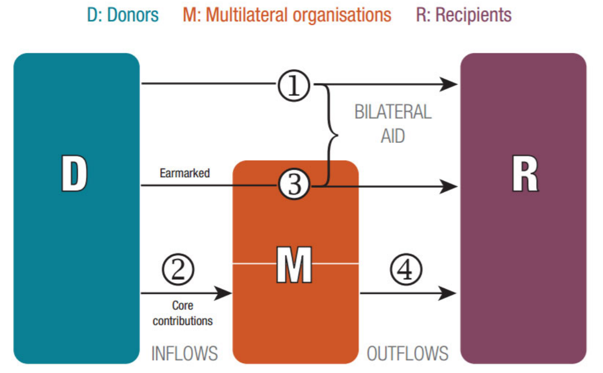

This section provides information on the data source that informs the PRESS, which is also used for reporting SDG indicator 17.19.1 (“Dollar Value of all resources made available to strengthen statistical capacity in developing countries”). As the PRESS aims to provide a comprehensive picture of international support to statistics, it is based on the OECD’s CRS database.[^1]

[^1]: All information on the CRS as well as access to the data can be found in the [OECD data explorer](https://data-explorer.oecd.org/vis?fs%5b0%5d=Topic%2C1%7CDevelopment%23DEV%23%7COfficial%20Development%20Assistance%20%28ODA%29%23DEV_ODA%23&fs%5b1%5d=Topic%2C2%7CDevelopment%23DEV%23%7COfficial%20Development%20Assistance%20%28ODA%29%23DEV_ODA%23%7CFlows%20on%20individual%20projects%20%28CRS%29%23DEV_ODA_FIP%23&pg=0&fc=Topic&snb=8&df%5bds%5d=dsDisseminateFinalDMZ&df%5bid%5d=DSD_CRS%40DF_CRS&df%5bag%5d=OECD.DCD.FSD&dq=DAC..1000.100._T._T.D.Q._T..&lom=LASTNPERIODS&lo=5&to%5bTIME_PERIOD%5d=false). 

Established in 1967, the CRS aid activity database has become the internationally recognized source of data on official development aid, widely used by governments, organisations and researchers active in the field of development. The CRS records project-level data from OECD Development Assistance Committee (DAC) members (donors), non‐DAC donors, multilateral organisations and private institutions. While the CRS reports on official development assistance (ODA), it also includes other types of financial flows in the form of other official flows (OOF), official export credits and private flows.

The CRS identifies project donors by looking at the source of the funding. Countries are identified as donors if the flow is directly between them and the recipient country (type 1 in Fig. [1](#fig-1-funding-flows)), or if the flow is earmarked for a certain project and channeled through multilateral organisations (type 3 in Fig. [1](#fig-1-funding-flows)). If a project is funded by un‐earmarked core contributions to multilateral organisations, the donors are marked as the multilateral organisations (types 2 and 4 in Fig. [1](#fig-1-funding-flows)).  

<h6 id="fig-1-funding-flows">Figure 1: Flow of official aid in the CRS.</h6>
<figure id="fig-funding_flows" markdown="span">
  { width="550" }
</figure>

While each project contained in the CRS is associated with a wide range of information such as sectorial and geographical coverage, financial flows or SDG and policy designations, the information most relevant to produce the PRESS will be covered in the following.

Donors report to the CRS using specific **purpose codes** for the sectors targeted by their aid activity. Statistical Capacity Building (SCB) is designated by the sector code 16062[^2] and will be a cornerstone in identifying support to statistics in the CRS. Each activity reported in CRS can be assigned with one of the over 100 purpose codes.[^3]

[^2]: Until 2019, this purpose was vaguely defined as “Both in national statistical offices and any other government ministries”. However, after a successful campaign to improve the description, this purpose is now defined as “All statistical activities, such as data collection, processing, dissemination and analysis; support to development and management of official statistics including demographic, social, economic, environmental, and multi‐sectoral statistics; statistical quality frameworks; development of human and technological resources for statistics, investments in data innovation.”

[^3]: While PARIS21 has successfully advocated in 2019 to introduce additional voluntary statistical purpose codes such as 12196 for “Health statistics and data” to provide more granularity within primary sectors, voluntary purpose codes are usually not assigned. However, code 16062 is not a voluntary code. See the [CRS codebook](https://webfs.oecd.org/oda/DataCollection/Resources/DAC-tables-CRS-codebook.xlsx) for more information.

In the CRS, **commitments** and **disbursements** are reported separately.[^4] Commitments refer to a firm, written obligation by an official donor to provide specified assistance to a recipient country or multilateral organisation, backed by the necessary funds. Bilateral commitments are recorded in full in the year the agreement is made, regardless of when the funds are disbursed. Commitments to multilateral organisations include both current-year disbursements not previously reported as commitments and expected disbursements for the following year. Disbursements record the actual transfer of funds from a donor to a recipient, or payments to service providers in the case of activities conducted within donor countries (e.g. training or administrative costs). They may be reported on a gross basis (total funds released) or net basis (after deducting loan repayments or recovered grants).

[^4]: The definitions follow the [OECD DAC Glossary](https://www.oecd.org/en/topics/sub-issues/oda-standards/glossary-of-statistical-terms-and-concepts-of-development-finance.html).

During the reporting process to the CRS, reporters have the option to assign one or more of 14 **policy markers** that capture cross-cutting policy objectives such as gender equality, environmental sustainability, or disaster risk reduction.[^5] Those markers indicate whether a project pursues the respective objective as its principal objective, a significant objective, or does not target the objective. In PRESS, the gender equality and reproductive, maternal, newborn and child health (RMNCH) markers are used to identify projects with a gender-related focus.	

[^5]: For more information on policy markers, please consult the [OECDs DAC FAQ](https://www.oecd.org/en/data/insights/data-explainers/2024/07/frequently-asked-questions-on-official-development-assistance-oda.html).

Each reported activity in the CRS is accompanied by a **project title**, a **short description**, and a **long description**. The short description frequently mirrors the project title, providing a brief reference to the activity, while the long description offers a concise overview of the project’s purpose and objectives. However, the level of detail and quality of reporting in long descriptions varies considerably — ranging from very brief entries to comprehensive, multi-paragraph narratives (for some examples, see Table [1](03_identifying_stat_projects.md#table-1-contextual-nuance)).

While the CRS is one of the most reliable and comprehensive databases that accounts for aid flows, several challenges arise when using it to measure funding for statistics:  

-	**Partial data and mixed-purpose projects**: Many activities primarily targeting other objectives include a significant statistical component that is not reflected in the project title or purpose code.
-	**Imprecise reporting**: In some cases, limited or unclear reporting makes it difficult to identify a project’s statistical objective based solely on its title or purpose code.[^6]
-	**Multilingual reporting**: Although English remains the predominant reporting language (78.3% of projects), other languages—such as French (11.8%), Spanish (4.1%), German (1.5%), and Italian (0.8%) — also represent a substantial share of CRS entries.[^7]
-	**Reporting lag**: CRS data is published with a 12-month reporting lag, and final updates may take up to 16 months after the reference year. As a result, PRESS data are released with delay approximately 18 months.

[^6]: E.g. project title: “Support for Poverty Assessment and Reduction in Caribbean Countries”, purpose code: “Social protection”, long description: “The TC will improve capabilities of the national statistical offices in the Anglophone Caribbean countries to...”.

[^7]: Languages detected via MetaAI’s [fasttext package](https://fasttext.cc/) [(Joulin et al., 2016)](https://arxiv.org/pdf/1607.01759)

To address these challenges, PARIS21 has developed a robust methodology to measure trends in support to statistics accurately.
