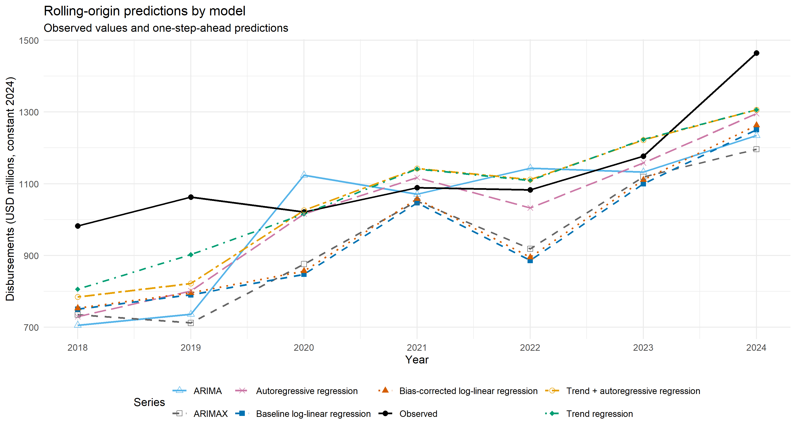
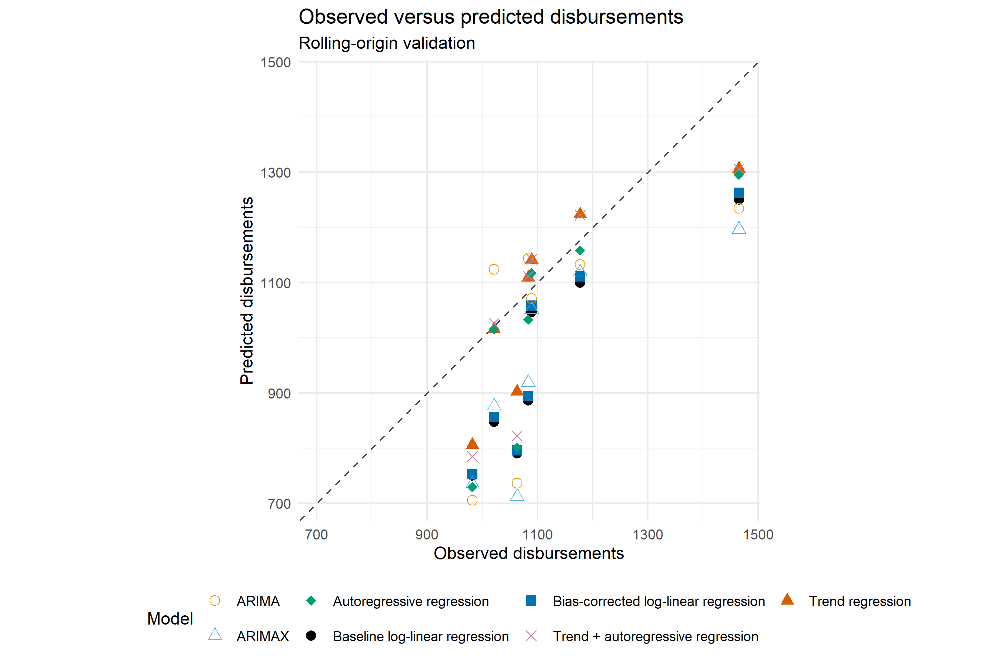
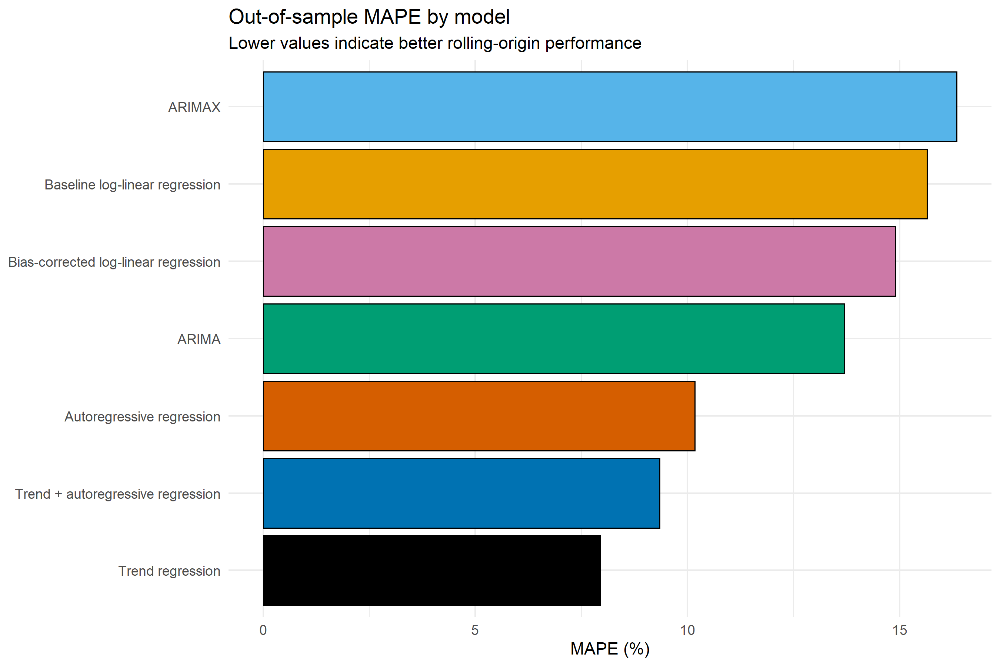
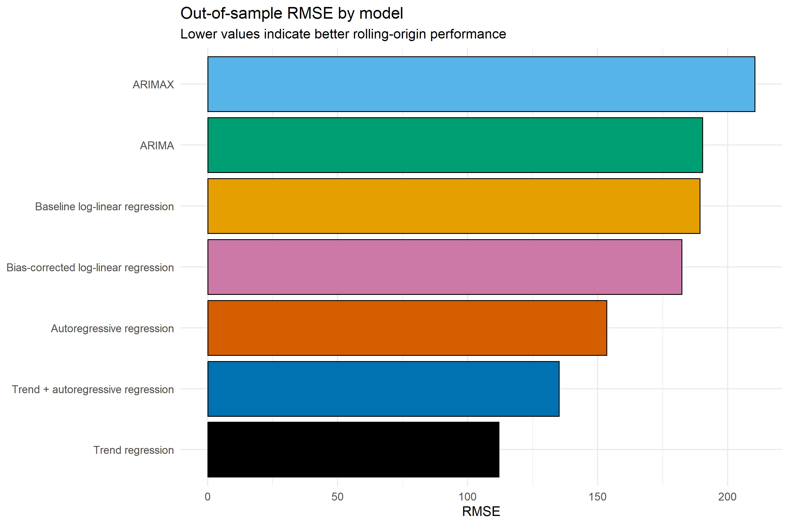
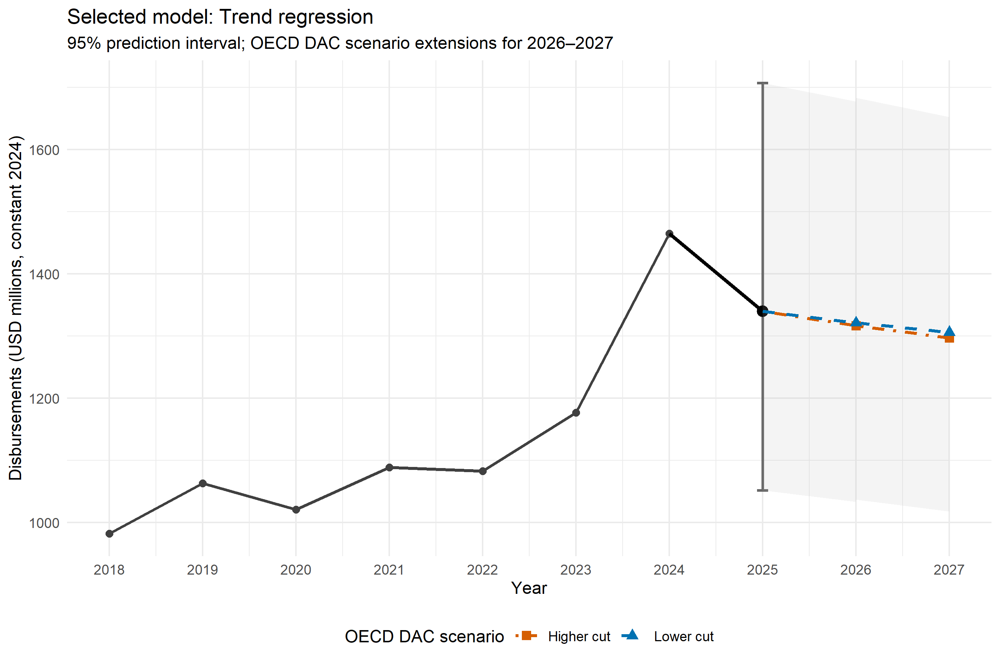
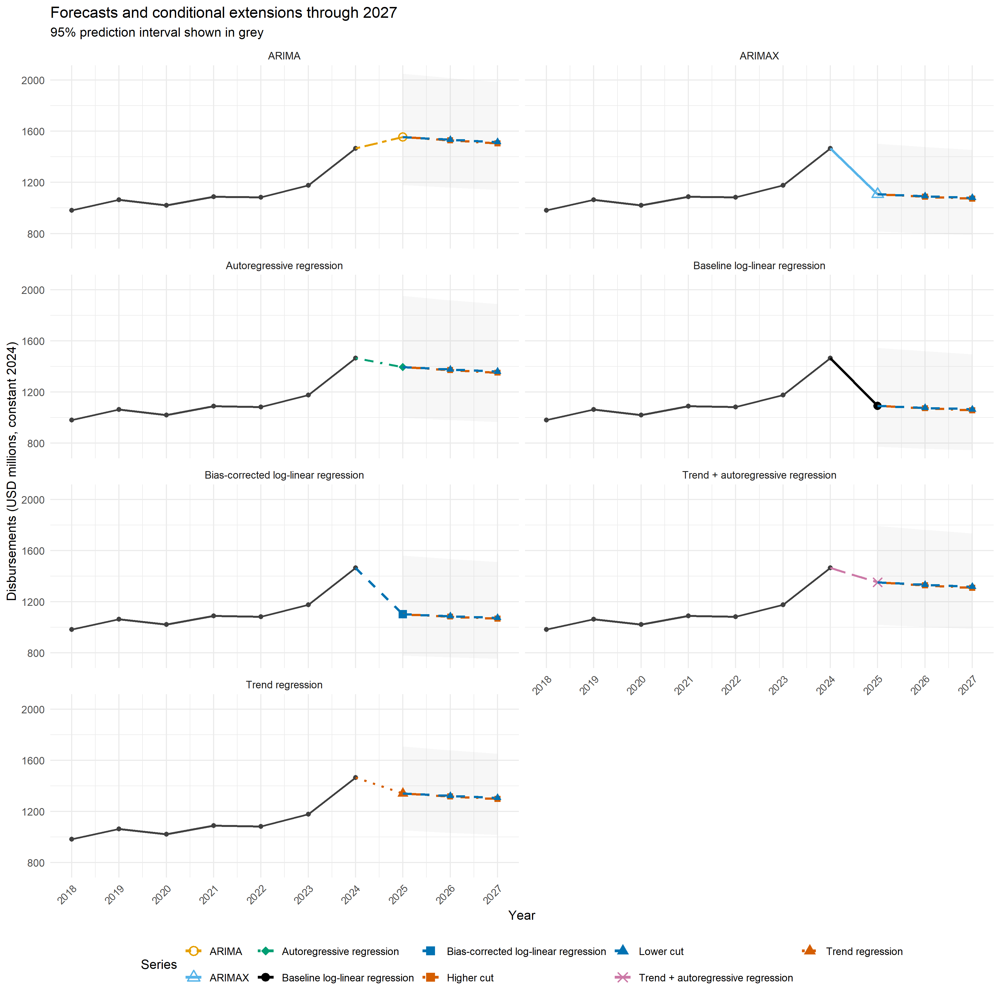

To address the reporting lag in the Creditor Reporting System (CRS) described in Section [2](02_data_source.md), PARIS21 complements the observed PRESS time series with a supply-side nowcasting and forecasting approach. The objective is to provide an early estimate of annual disbursements before complete CRS data become available, while making the uncertainty of the estimate explicit and keeping the procedure reproducible across PRESS cycles.

The approach is based on annual aggregate PRESS data and combines model comparison, rolling-origin validation and scenario-based extensions. For the PRESS 2025 cycle, the modelling dataset covers 2018–2024 and uses annual commitments and disbursements. Seven candidate models are evaluated, and the model with the strongest out-of-sample predictive performance is selected to produce the operational estimate for 2025.

## 5.1 Nowcasting and forecasting workflow

The workflow consists of five main steps:

1. Aggregate annual PRESS commitments and disbursements and construct the lagged variables required by the candidate models.
2. Fit seven alternative statistical models representing different assumptions about the relationship between commitments, past disbursements and time.
3. Evaluate the models using rolling-origin validation, in which each model is repeatedly re-estimated using only information that would have been available before the year being predicted.
4. Select the operational model based primarily on out-of-sample prediction error and use it to produce the 2025 estimate together with a 95% prediction interval.
5. Extend the operational estimate conditionally to 2026–2027 using the OECD DAC Higher-cut and Lower-cut ODA projection scenarios.

This sequence is designed to mimic the annual PRESS production setting as closely as possible. In particular, model selection is based on historical one-step-ahead predictions rather than in-sample fit alone.

## 5.2 Candidate models

The nowcasting and forecasting framework compares seven candidate specifications. These models were selected to capture different potential sources of predictive information while remaining sufficiently transparent for operational use:

1. **Baseline log-linear regression.** Annual disbursements are predicted from the previous year's commitments after logarithmic transformation.
2. **Bias-corrected log-linear regression.** The baseline specification is retained, but retransformation to the original scale is adjusted using Duan's smearing estimator to reduce retransformation bias.
3. **Trend regression.** A deterministic time trend is used to capture systematic changes in disbursements over time.
4. **Autoregressive regression.** The previous year's disbursements are used as a predictor of the current year.
5. **Trend + autoregressive regression.** The deterministic trend and lagged disbursements are combined in a single specification.
6. **ARIMA.** An autoregressive integrated moving-average model is fitted to the historical disbursement series. The model order is selected automatically using the corrected Akaike Information Criterion (AICc).
7. **ARIMAX.** The time-series structure of disbursements is combined with lagged commitments as an external regressor. A fixed ARIMAX(1,0,0) specification is used.

Comparing several model classes reduces reliance on a single structural assumption. Some specifications emphasise the relationship between commitments and later disbursements, while others rely primarily on the historical trajectory of disbursements themselves.

## 5.3 Rolling-origin validation

Because the PRESS series is annual and temporally ordered, the candidate models are assessed using **rolling-origin validation** rather than a random train/test split. At each validation step, a model is estimated using only observations available up to that point and then used to generate a one-step-ahead prediction for the following year. The estimation window is subsequently expanded and the procedure repeated. This mimics the conditions under which an operational forecast would have been produced in previous PRESS cycles.

The resulting predictions allow the observed and predicted trajectories to be compared across candidate models.

<h6 id="fig-rolling-origin-predictions">Figure 2: Rolling-origin one-step-ahead predictions produced by each candidate forecasting model.</h6>
<figure id="fig-rolling_origin_predictions" markdown="span">
  { width="700" }
</figure>

A complementary observed-versus-predicted comparison provides a direct indication of how closely the model outputs align with the realised disbursements across all validation years. Values closer to the 45-degree reference line indicate stronger predictive agreement.

<h6 id="fig-observed-vs-predicted">Figure 3: Observed versus predicted disbursements obtained from rolling-origin validation.</h6>
<figure id="fig-observed_vs_predicted" markdown="span">
  { width="650" }
</figure>

## 5.4 Model comparison and selection

Model performance is evaluated using several indicators:

- **Mean Absolute Percentage Error (MAPE)**, measuring the average percentage difference between observed and predicted values;
- **Root Mean Squared Error (RMSE)**, measuring the magnitude of prediction errors while giving greater weight to larger deviations;
- **R²**, as a complementary measure of agreement between observed and predicted values; and
- **direction accuracy**, indicating whether the model correctly predicts the direction of year-to-year change.

Operational model selection is based primarily on out-of-sample MAPE and RMSE. Lower values indicate stronger predictive performance.

<h6 id="fig-mape-comparison">Figure 4: Out-of-sample Mean Absolute Percentage Error (MAPE) for each candidate forecasting model.</h6>
<figure id="fig-mape_comparison" markdown="span">
  { width="650" }
</figure>

<h6 id="fig-rmse-comparison">Figure 5: Out-of-sample Root Mean Squared Error (RMSE) for each candidate forecasting model.</h6>
<figure id="fig-rmse_comparison" markdown="span">
  { width="650" }
</figure>

For the PRESS 2025 cycle, the trend regression achieves the lowest out-of-sample MAPE and RMSE among the candidate models. It is therefore selected as the operational forecasting model. The autoregressive and trend + autoregressive specifications also show competitive predictive performance, while the baseline log-linear regression and ARIMAX produce comparatively larger errors.

## 5.5 Operational forecast and conditional extensions

After model selection, the preferred specification is re-estimated using the complete observed time series and used to generate the 2025 operational forecast. A **95% prediction interval** is calculated alongside the point forecast to represent the uncertainty associated with predicting an unobserved annual value.

The selected trend regression indicates a moderate decline in disbursements from the unusually high level observed in 2024. This estimate is then conditionally extended to 2026–2027 using the OECD DAC **Higher-cut** and **Lower-cut** ODA projection scenarios.

The OECD DAC scenarios are not included as explanatory variables during model estimation and therefore do not affect model selection. Instead, the selected 2025 forecast is scaled according to the annual ODA growth rates implied by the two scenarios. The resulting values should therefore be interpreted as **conditional scenario extensions**, rather than independent statistical forecasts.

<h6 id="fig-oecd-scenario-extensions">Figure 6: Operational forecast and conditional extensions under OECD DAC Higher-cut and Lower-cut ODA projection scenarios.</h6>
<figure id="fig-oecd_scenario_extensions" markdown="span">
  { width="700" }
</figure>

As an additional robustness check, the historical series and medium-term projections can also be compared across all candidate models. Although the models differ in their statistical formulation, their projected medium-term trajectories are broadly consistent, with most specifications indicating a modest decline following the high disbursement level observed in 2024.

<h6 id="fig-all-model-forecast-comparison">Figure 7: Forecast comparison across all candidate forecasting models with conditional OECD DAC scenario extensions.</h6>
<figure id="fig-all_model_forecast_comparison" markdown="span">
  { width="750" }
</figure>

## 5.6 Limitations and future development

The nowcasting and forecasting framework is designed primarily for operational prediction rather than formal time-series inference. The historical annual series is relatively short, limiting the complexity of models that can be estimated reliably and increasing uncertainty around model comparisons. Formal stationarity diagnostics, such as Augmented Dickey-Fuller tests, are not conducted for the autoregressive models because model selection is based on out-of-sample rolling-origin performance.

The framework can be refined as additional annual observations become available. Potential extensions include alternative model-selection criteria, additional exogenous predictors, probabilistic scenario analysis and bootstrap prediction intervals. The modular structure of the workflow allows these improvements to be incorporated in future PRESS cycles while retaining a transparent and reproducible validation process.

  