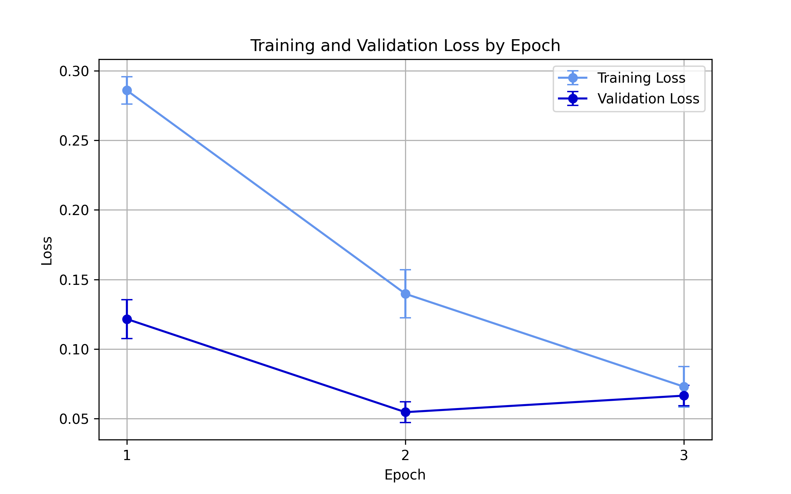
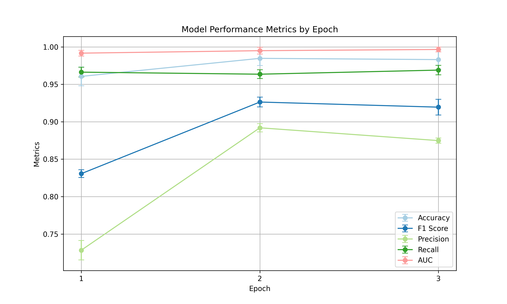
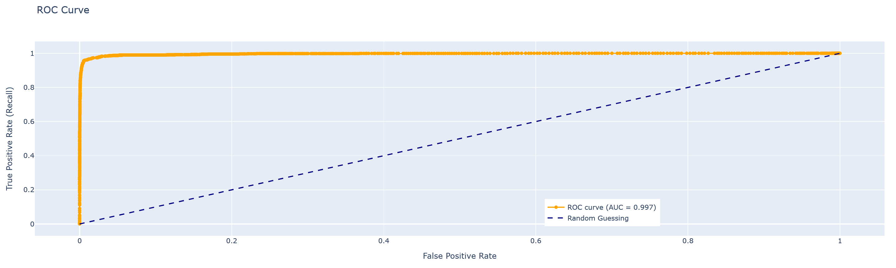

<figure markdown="span">
  { width="600" }
  <figcaption>Figure A.1: Training and validation loss during training with the verified training set.</figcaption>
</figure>

<figure markdown="span">
  { width="600" }
  <figcaption>Figure A.2: Performance metrics during training with the verified training set.</figcaption>
</figure>

<figure markdown="span">
  { width="1000" }
  <figcaption>Figure A.3: ROC curve after the final training round on the verified training set.</figcaption>
</figure>