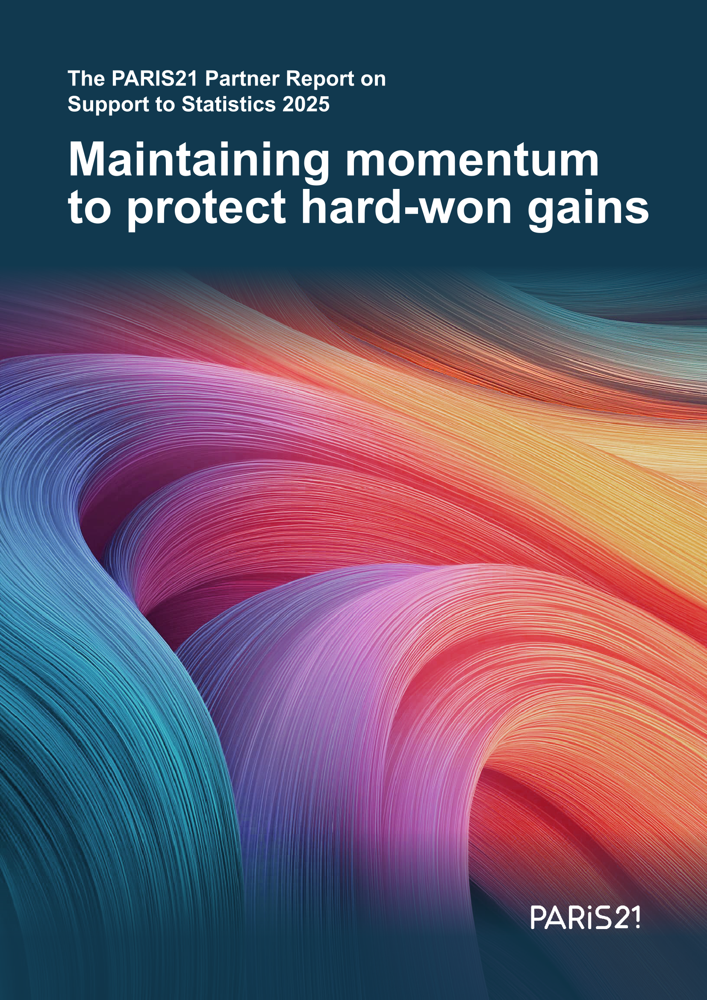

# PRESS Methodology Note

### Abstract 

The Partner Report on Support to Statistics (PRESS), published annually by PARIS21 since 2006, provides a comprehensive overview of official aid flows targeted towards strengthening statistical systems. This methodology note details the processes used to compile the PRESS database, including data sources, analytical procedures and recent innovations. Building on the OECD Creditor Reporting System (CRS), the methodology integrates targeted filtering with a novel AI-based classification framework, leveraging large language models (LLMs) to assess project relevance to statistics and thereby enabling a more nuanced understanding of global funding trends for statistics within development co-operation.

 

<figure id="fig-funding_flows" markdown="span">
  { width="550" }
</figure>

 
